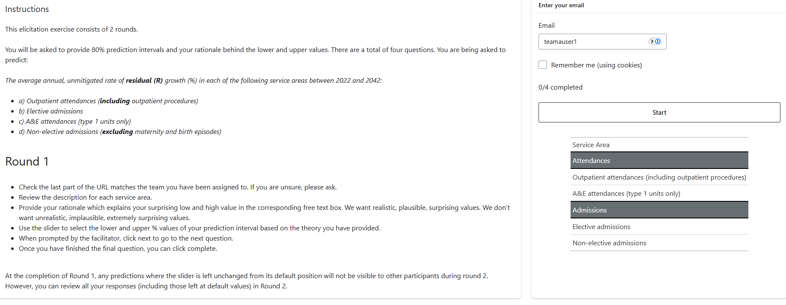
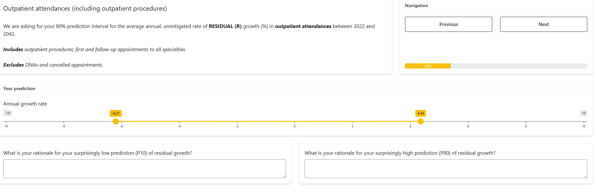
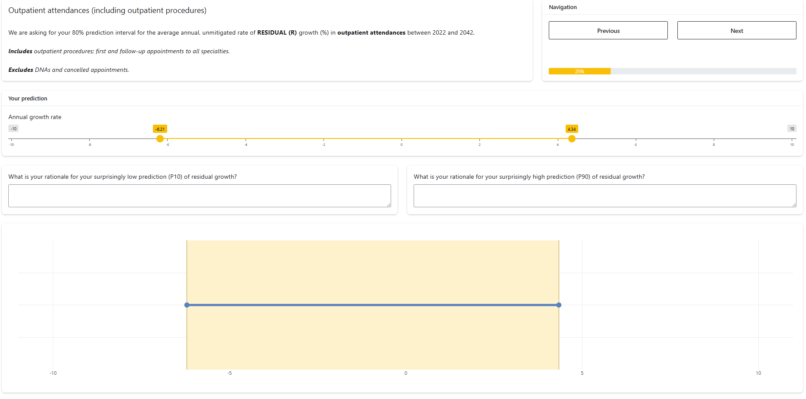

<!-- README.md is generated from README.Rmd. Please edit that file -->

# NDG3 elicitation app

This repo contains the shiny app code for the NDG3 elicitation exercise.
The exercise was in person on 9th October 2024.

The aggregation and analysis of the results is on
[GitHub](https://github.com/The-Strategy-Unit/NDG_prediction_aggregation).
The results are stored privately on
[Sharepoint](https://csucloudservices.sharepoint.com/sites/HEUandSUProjects/Shared%20Documents/Forms/AllItems.aspx?id=%2Fsites%2FHEUandSUProjects%2FShared%20Documents%2FNew%20Hospitals%20Programme%2F03%2E%20Programme%20Delivery%2F01%2E%20Workstream%20Project%20Documents%2FNDG%20Elicitation%2FResults&viewid=9e82fcc3%2Df0f4%2D4f15%2D9420%2D79b8cb38998c).

You can [read the report](residual_growth_elicitation_report.pdf) of the
full study and analysis.

## Main changes from [core elicitation app](https://github.com/The-Strategy-Unit/nhp_elicitation_tool)

- Rather than elicit on mitigators, experts were asked about “The
  average annual, unmitigated rate of **residual (R)** growth (%) in
  each of the following service areas between 2022 and 2042” annual
  growth in attendence for four service areas; ED, IP elective, IP
  emergency and OP
- Historic trend data was not visualised
- Values chosen could be between -10 and 10.
- Experts were split into two teams. These were handled as two seperate
  apps `ndg_team_a` and `ndg_team_b`

## Screenshots from the app

### Landing page

### Round 1

### Round 2

## Deployment

The script `deploy.R` can be used to redeploy to the production and
development environments.

The app is controlled by some environment variables that need to be set:

- `PHASE_1_END` should be the time and date when the first phase should
  end (in the form `YYYY-mm-dd HH:MM:SS` for the timezone
  `Europe/London`)
- `PHASE_2_END` should be as `PHASE_1_END`, but the time and date for
  when the second phase should end
- `PHASE_2_LIVE` should be set to a non-empty string to enable the
  second phase of the app: this allows the app to enter a “disabled”
  state at the end of phase 1
- `NHP_SALT` is a value that is used when encrypting the emails of users
- `save_path` should point to the location where to save the database
  to. If not set, then it defaults to the current working directory

## Development usage

The data required to run the app can be rebuilt using
`targets::tar_make()`. There are a few things that need to be set up in
order to get this to work.

1)  you will need to create a `.Renviron` file, with the following
    items:

- DB_SERVER=…
- DB_DATABASE=…
- NHP_SALT=…

2)  you will need to be connected to the MLCSU VPN and have access to
    the database.

3)  you will need a copy of the file `recruitment.xlsx`, stored in the
    root of the project folder.
